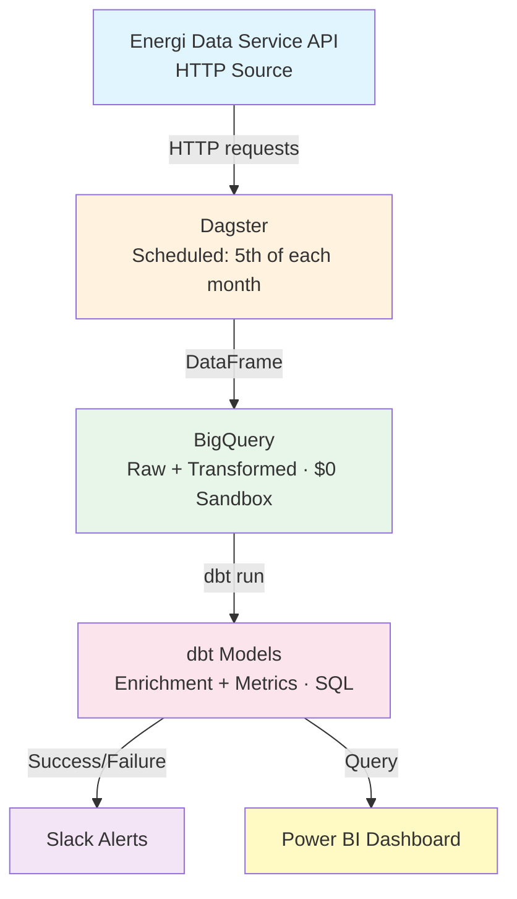

# Danish Energy Transition Pipeline

**Track renewable energy adoption across 98 Danish municipalities | Production Data Engineering Portfolio**

## Problem Statement
Denmark aims for 100% renewable electricity by 2030. But which municipalities are actually transitioning vs. still relying on thermal? This pipeline answers that question by tracking monthly wind, solar, and thermal capacity data.

## Architecture


## Tech Stack & Trade-offs

| Component | Choice | Why not X? |
|-----------|--------|-------------|
| Orchestration | Dagster | Asset lineage > Airflow DAGs; Python-native |
| Warehouse | BigQuery Sandbox | $0, serverless, industry standard |
| Transformations and Quality | dbt-core | SQL-only, version-controlled testing |
| Monitoring | Slack webhook | Simple, no paid tier needed |
| Dashboard | Power BI | Enterprise BI; free desktop version |

## Key Features

###  Incremental Loading
- Pipeline tracks `last_run_date` in BigQuery metadata table
- Only fetches new records each month (WRITE_APPEND)
- Reduced API calls from 60+ to 1 per month

###  Data Quality Gates
- **dbt tests**: Not-null, unique on MunicipalityNo, Month

###  Production Monitoring
- Slack alerts on success/failure
- Pipeline fails fast if quality checks fail
- Dagster UI for lineage + logs

###  Enrichment
- Joined municipality names (English/Danish) and 5 regions
- Calculated `renewable_percentage = (Wind + Solar) / Total * 100`

## How to Run

```bash
# Clone & setup
git clone https://github.com/ahmedbt/dk-energy-pipeline
cd dk-energy-pipeline
python -m venv venv && source venv/bin/activate
pip install -r requirements.txt

# Set secrets
export SLACK_WEBHOOK_URL="your_webhook"
gcloud auth application-default login

# Run full pipeline
python run_simple.py

# Run dbt tests
cd energy_dbt && dbt test

# Launch Power BI dashboard (open dk_energy_dashboard.pbix)
```
## Sample Output

**Slack Alert (Success):**

> ✅ Pipeline succeeded: Loaded 98 new records. Renewable %: 42.3% nationally.

**Power BI Dashboard Shows:**

- National renewable sources trend (2019–2026)
- Regional leaderboard (Region Syddanmark: 68% renewable)
- Municipality drill-down: Samsø at 100% renewable

## What I'd Improve with More Time

1. Partition BigQuery table by month (currently full scan)
2. Deploy to Dagster Cloud (always-on scheduler)
3. Add GitHub Actions CI/CD (tests on push)
4. Backfill handling for late-arriving data

## Lessons Learned

- **String vs. Date:** Storing `Month` as `STRING` avoided PyArrow errors; moved date validation to dbt
- **Service Account JSON:** Must be minified to a single line for Power BI
- **Duplicate model definitions:** Models only in `schema.yml`, sources only in `sources.yml`
